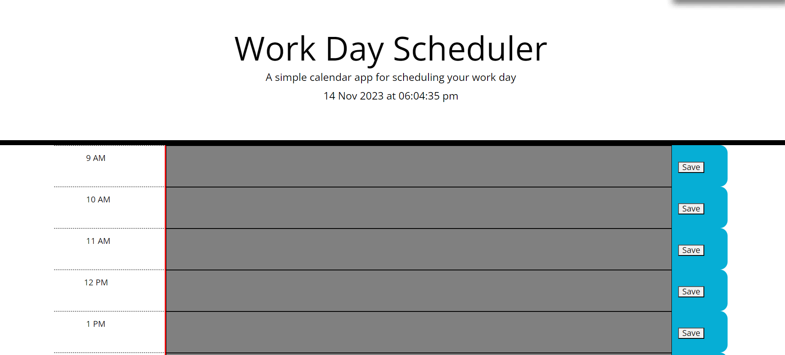

# GPplanner

This project should help you maintain and organize your working callendar starting with 9 AM - till 5 PM, by simply writing in the text area your tought and plans for the respective hour and save it to the local storage.

## Installation.

For the installation of the program, you'd only need to click on the link below: 

https://m4r1an24.github.io/GPplanner/

This link will take you to the calendar and there you can simply use it.

Here's a screenshot of what you should see: 

## Deployment 

For the deployment of the website, you'll only have to click on the link above and use it on an acceptable browser.

## Built with

This project was build with HTML, CSS, JavaScript, jQuery, Web API.

## Authors

Gabriel Pamfil and with the assitance of Scott Everett

## License

MIT

## Acknowledgments

Scott Everett - Instructor which helped me with inspiration for the code and debugging. 